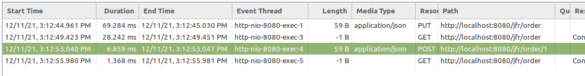

### Java Flight Recorder
Project demonstrates how to send custom jdk flight record events

Event body looks:

#### IntelliJIdea
1. Settings/Preferences -> Build, Execution, Deployment -> Java Profiler -> Java Flight Recorder
2. [Custom settings file](https://www.jetbrains.com/help/idea/java-flight-recorder.html#jfr-configurations): `/resources/jfr/template-config.jfc`